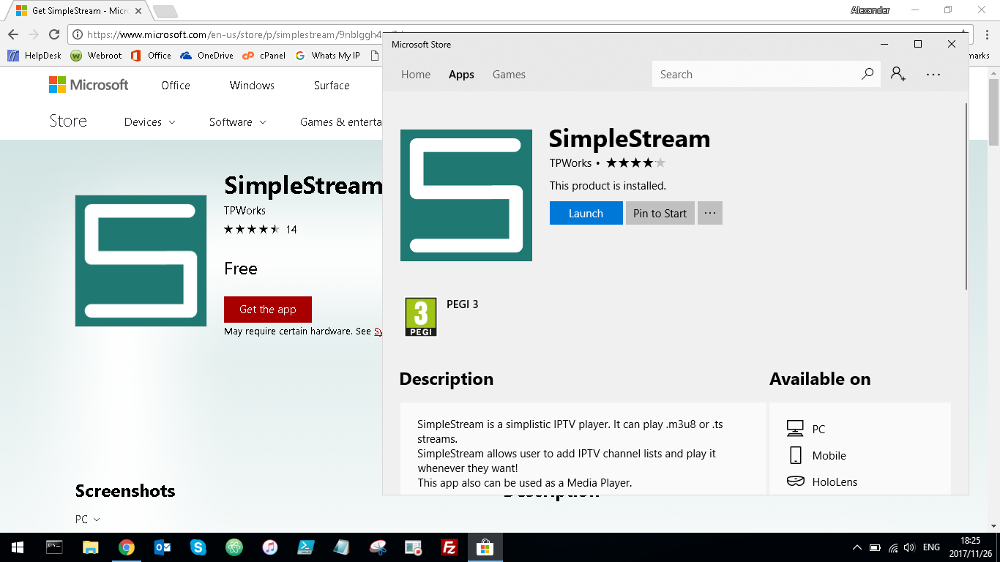
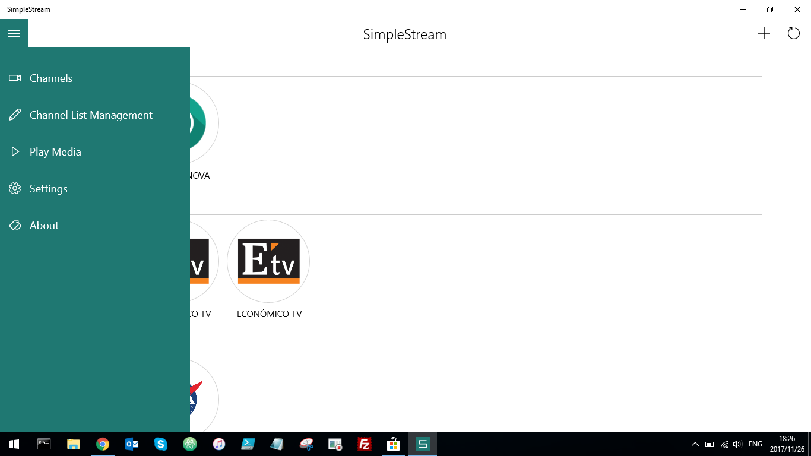
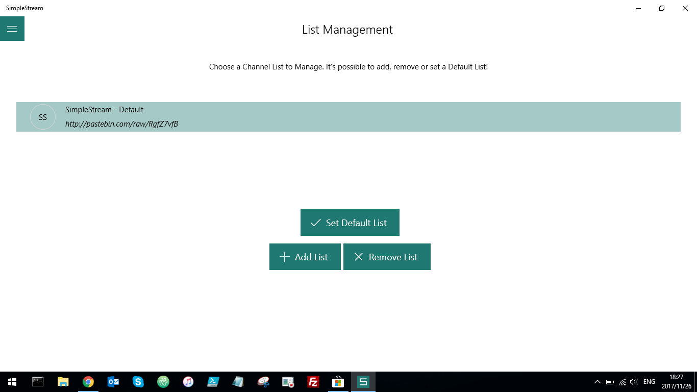
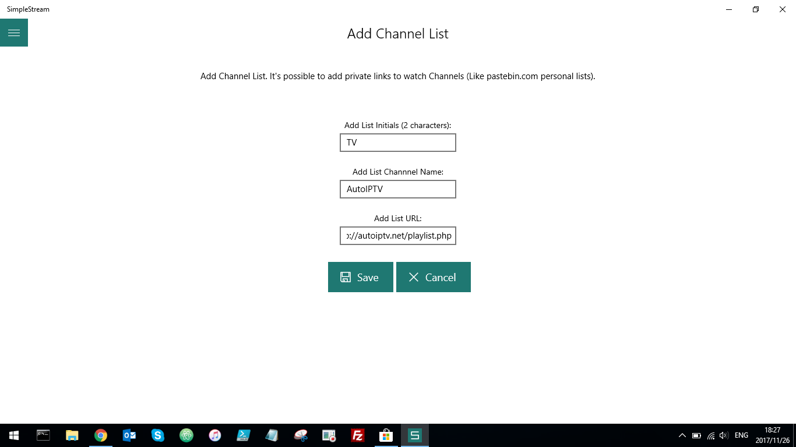
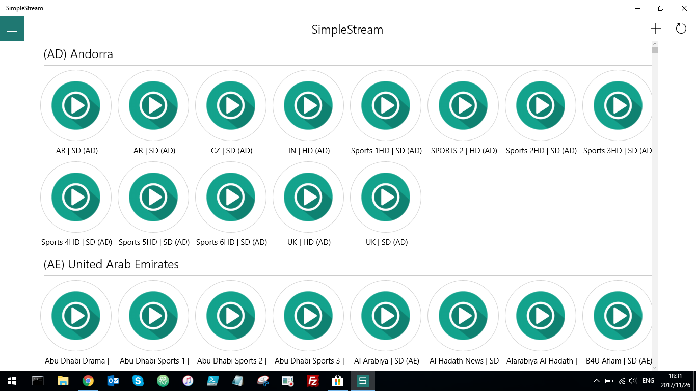
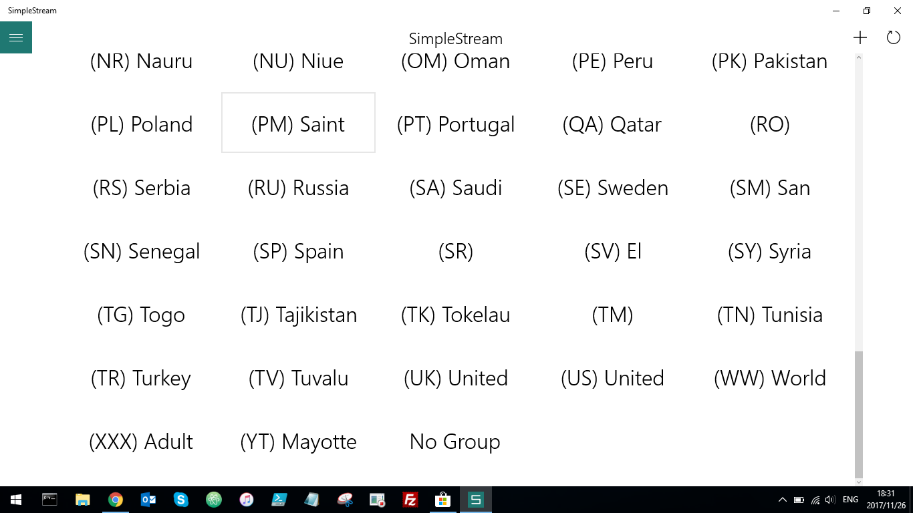

# [AutoIPTV](http://autoiptv.net) - Watch Free IPTV World Wide

### Playlist

> http://autoiptv.net/playlist.php

Watch live TV channels from across the world as the playlist gets updated on a daily basis, as well as throughout the day the number of channels increase. It will find new and working links and add them to the playlist automatically for you to enjoy. AutoIPTV provides dynamic content with a static URL, thus making it possible to use the same URL for any device on the market.  

## How to Install (Windows)

> 1.
> 
> - Go to *https://www.microsoft.com/en-us/store/p/simplestream/9nblggh4qr2d*
> - Click on **Get the app**
> - Click on the button that appears **Open Microsoft Store**

----

> 2.
> 
> - Download the app from the Microsoft Store
> - Once downloaded click on the **Launch** button

----

> 3.
> 
> - Select the menu in the top left hand corner
> - Select the **Settings** option

----

> 4.
> 
> - Click on the switch so that it is set to *Categories*

----

> 5.
> 
> - Select the menu again
> - Select the **Channel List Management** option

----

> 6.
> 
> - Click on the **Add List** button

----

> 7.
> 
> Enter in the following in order:
> - [x] TV
> - [x] AutoIPTV
> - [x] http://autoiptv.net/playlist.php
> - Click **Save** once done

----

> 8.
> 
> - Select the list we just added, *AutoIPTV*
> - Click on the **Set Default List** button

----

> 9.
> 
> - Select the menu again
> - Select the **Channels** option

----

> 10.
> 
> If you select one of the headers, for instance: *(AD) Andorra, (AE) United Arab Emirates, ...*, you'll be able to change the category, namely the country

----

> 11.
> 
> Select whichever one you want

----

> ### PS. 
> - When you want to view a channel, click on one of the play buttons. When you want to exit that channel, double click on the screen.
> - Every hour the channels get updated, new ones added, etc. So to refresh click the **Circular** button in the top right hand corner.
